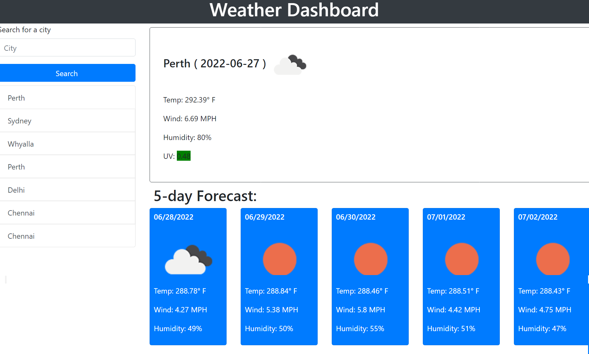

# WeatherDashboard
# WorkDayScheduler
## Table of contents
* [General info](#general-info)
* [Website Link](#website-link)
* [Screenshot](#screenshot)

## General info
This is a weather dashboard that will allow a user to search for a city and display the weather results.

## Changes

* This is a weather dashboard that will allow a user to search for a city and display the weather results.

* The weather is displayed using the OpenWeatherMap API.

* The user's search history is displayed in the left column. The current weather will be displayed at the top right section and the 5-day forecast will display below current.

* The current weather data includes an icon, current temp, humidity, wind speed and UV index. The UV index will change color based on low-severe conditions.

* The 5-day forecast includes the date, icon, daily temp, and humidity.

* The last searched city will be saved in local storage. The next time the user opens the weather dashboard, their last searched city will display with current weather information.

## Website Link

> Live link []

## Screenshot
The following image shows the web application's appearance and functionality:

